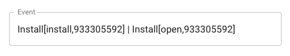
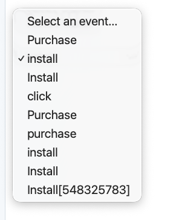
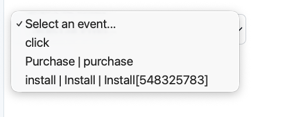

# Frontend Challenge

## Getting Started

This repo is configured as a **CodeSandbox Devbox**. When the sandbox loads:

- The **Vite dev server** boots automatically on **port 3000**. You'll see the running app in the preview pane.
- **Storybook** also boots automatically on **port 9001**. Open it from the Previews list to inspect the `EventSelector` and `DataTable` stories.
- Run **Tests** any time from the **Tasks** panel (left rail).

Dependencies are installed on first boot. You do not need to run `npm install` yourself.

### Optional: terminal commands

If you prefer the terminal (or are running locally with Node 20.14.0):

```bash
npm run dev          # Vite dev server, http://localhost:3000
npm run storybook    # Storybook, http://localhost:9001
npm test             # Vitest, watch mode
npm run test:run     # Vitest, one-shot
```

## Goal

- **Understand the problem well**: Ask all the questions to make the problem clear to you. 
- **Think out loud about your solution**: Share your approach with us before you start implimenting.

#### Additional Notes

- This challenge is designed to be completed in approximately 30 to 60 minutes.
- The focus is on demonstrating your approach and practices rather than achieving a pixel-perfect solution.
- Feel free to introduce any components, abstractions, tests, or dependencies that you find appropriate for the task.

## Context

Our customers are the companies behind mobile apps used by millions of people.

They send us a continuous stream of different events through an intermediate Partner.
The `EventKind` is identified by the name attached to each event (i.e `install` or `purchase`)

Sometimes when the customer changes the settings or even the intermediate partner
the casing of the name can change or an id might be attached in square brackets to the name (i.e `install[548943784]`).

We normalize the name that is sent to us to compensate for this in our backend
as events like `Purchase` and `purchase` still mean the same thing,
but we need to be able to differentiate between events with different original names
to communicate with the intermediate Partners.

## Task: EventSelector

Build a component that allows the user (=someone working in our company) to select one of the given [EventKinds](./src/components/EventSelector.tsx) to control what normalized event name we are targeting in our backend.

To get started, refer to the following files: [EventSelector.tsx](./src/components/EventSelector.tsx), [EventSelector.stories.tsx](./src/stories/EventSelector.stories.tsx), and [eventSelectOptions.tsx](./src/utilities/eventSelectOptions.tsx).

For the options that represent [EventKinds](./src/components/EventSelector.tsx) that overlap in their `normalizedName`, ensure that the label displays this overlap to the user. An example of how this could be done is shown below:



You can see the EventSelector by opening the **Storybook** task and selecting the `EventSelector` story. Try both `Selector` and `SelectorWithOverlappingEvents`.

## Preview (EventSelector)

Before, the initial selector state with no overlap handling:



After, overlapping `normalizedName` values collapsed into a single option with original names joined by ` | `:



## Bonus Task: Bug Hunt in DataTable

The `DataTable` component (see [DataTable.tsx](./src/components/DataTable.tsx)) fetches two lists in parallel, a list of budgets and a list of budget forecasts, and renders them together as a single table.

There is a bug in how the two data sources are combined: the forecast value shown on each row does not always belong to the budget on that row.

Your task:
- Identify the cause of the mismatch.
- Fix it.
- Add a one-line note in your submission explaining what was wrong.

You can see the rendered table by opening the **Storybook** task and selecting the `DataTable` story.


